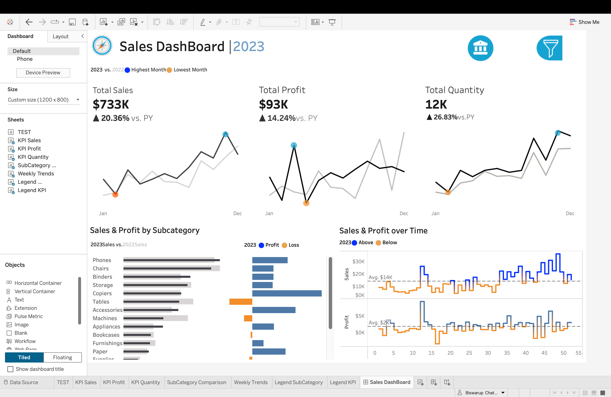

# 🛍️ 2023 Retail Sales Performance & Profitability Analysis
### A Business Intelligence Project on Product Margins and Seasonal Consumer Demand

🔗 **[View Live Interactive Dashboard on Tableau Public](https://public.tableau.com/app/profile/biswarup.chatterjee/viz/Sales_Dashboard_17808468189870/SalesDashBoard?publish=yes)**

---

## 📈 Project Overview
In a fast-moving retail business, scaling up sales volume is exciting, but it can mask major profit losses if specific inventory items cost too much to stock or ship. 

This project analyzes **\$733K in retail transactions for the fiscal year 2023**. The goal of this dashboard is to track Year-over-Year (YoY) s growth, pinpoint exactly which retail subcategories are hurting net margins, and map seasonal shopping spikes to help store managers optimize inventory decisions.

---

## 🎯 Key Retail Metrics & Performance (FY 2023)
* **Total Retail Sales:** **\$733K** (📈 **+20.36%** growth vs. last year)
* **Net Profit:** **\$93K** (📈 **+14.24%** growth vs. last year)
* **Items Sold (Quantity):** **12K units** (📈 **+26.83%** increase in checkout volume)

**The Retail Data Insight:** Our checkout volume grew by over 26%, but store profits only grew by 14%. This tells us that while we are successfully moving more merchandise off the shelves, our profit margins are getting tighter—likely because a few specific product categories are draining our returns.

---

## 💡 Retail Insights & Actionable Outcomes

### 1. Stopping the Margin Loss in "Tables" and "Machines"
* **The Problem:** Looking at the *Sales & Profit by Subcategory* chart, the orange loss bars stand out instantly. **Tables** and **Machines** generate a lot of top-line store revenue, but their net profit is deeply negative. Tables are the biggest profit drain in our entire retail catalog.
* **Actionable Outcome:** I recommend pausing promotional store discounts on Tables. Instead, the merchandising team should look into raising the shelf price of Tables by **8%** or sourcing from a lower-cost furniture manufacturer to make this inventory line profitable.

### 2. Doubling Down on High-Margin "Copiers"
* **The Problem:** On the flip side, **Copiers** show huge blue profit bars. They don't require massive transactional volumes to generate great returns for the store, making them an incredibly efficient product line.
* **Actionable Outcome:** Store managers should design product bundle offers (e.g., bundling retail paper or desk accessories together with a Copier purchase) to maximize revenue from our most profitable inventory assets.

### 3. Preparing the Supply Chain for the Q4 Holiday Surge
* **The Problem:** The *Sales & Profit over Time* weekly line chart reveals extreme retail seasonality. The store experiences a massive, predictable surge in customer purchases between **Weeks 45 and 51** (the November-December holiday shopping rush). 
* **Actionable Outcome:** To prevent running out of stock during the busiest time of the year, I recommend that the logistics team scales up warehouse stock levels **4 weeks in advance** (by Week 41) to ensure the shelves stay full.

---

## 🛠️ Tableau Techniques Used
* **KPI Summary Cards:** Designed clean metric blocks at the top with trend lines to show store performance at a glance.
* **Dual-Axis Charts:** Combined retail sales lines and net profit lines on a single timeline to clearly see if profit keeps up with sales velocity.
* **Conditional Color Coding:** Programmed the charts to automatically turn blue for profit and orange for loss so bad merchandising trends can be spotted instantly.

---

## 📸 Dashboard Preview

---
*Developed by Biswarup Chatterjee. Connect with me on [LinkedIn](http://www.linkedin.com/in/biswarup-chatterjee-6317b827a/) to discuss data analytics and business intelligence.*
